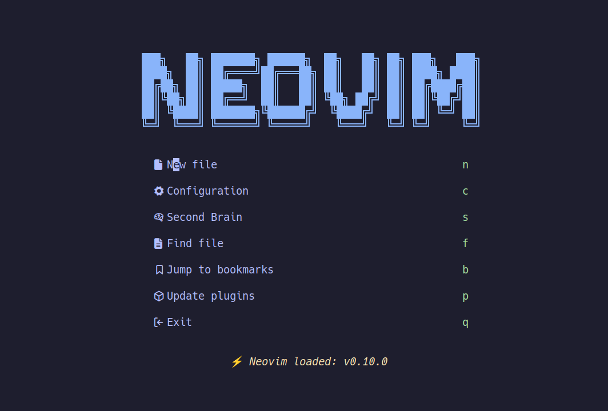
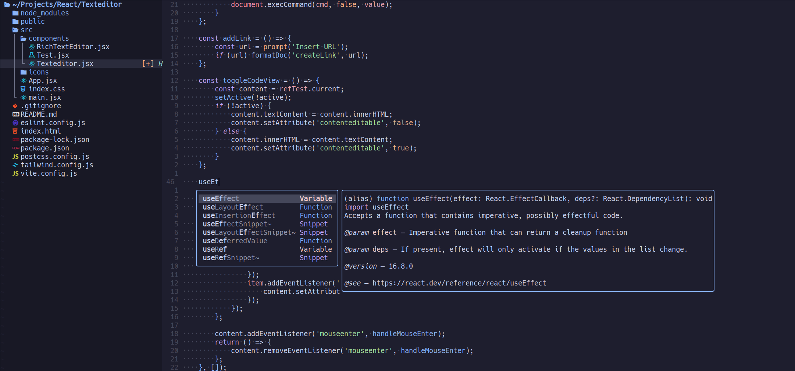
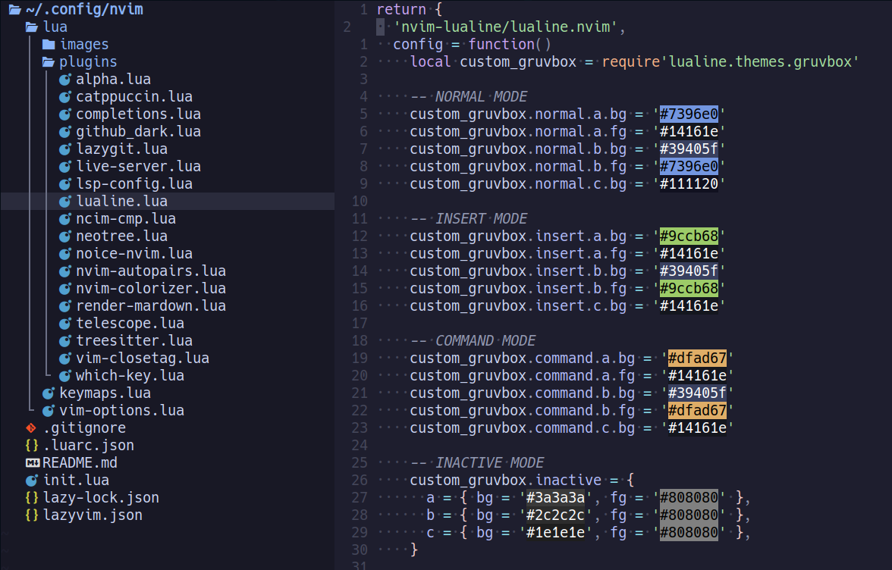
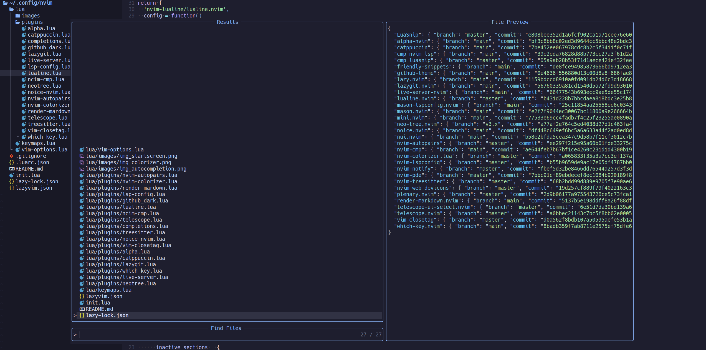
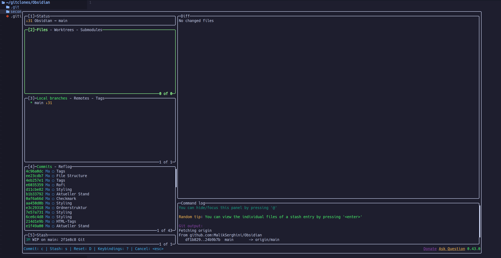
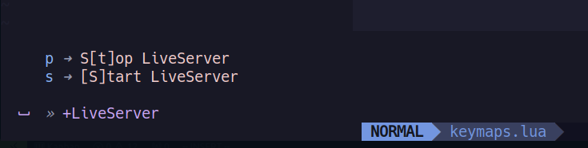
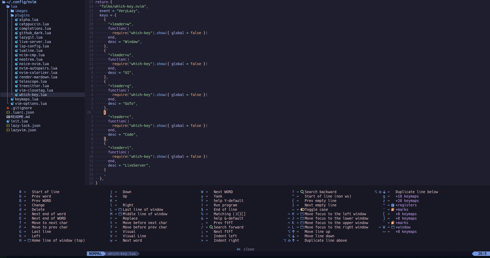

# Neovim configuration
This repository contains my personal Neovim configuration files. Here, I've organized my init.lua, plugins, and various configuration files.

This Neovim configuration is a collection of settings and ideas I've gathered from various configurations and community resources. I've customized and adapted them to fit my workflow, and this setup will continue to evolve.

## Prerequisites
Ripgrep: This configuration uses ripgrep for fast file searching. To install ripgrep, run:

```bash
sudo apt install ripgrep
```

## StartScreen


## Autocompletion


## Colorizer


## Telescope


## Git 


## LiveServer


## WhichKey



## 📂 File Structure
```
~/.config/nvim
├── lua
│   └── keymaps.lua
│   └── vim-options.lua
│   └── plugins
│       ├── spec1.lua
│       ├── **
└── init.lua
```
